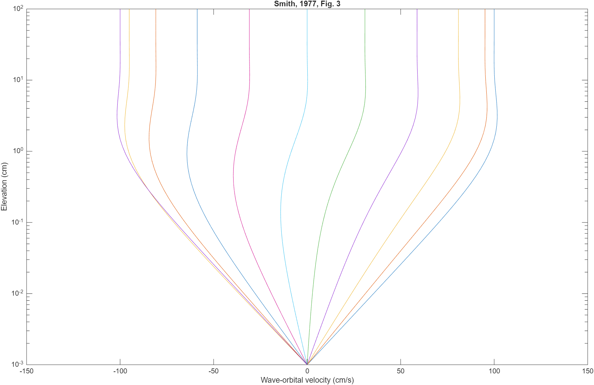

### Scripts for wave boundary layers

  

#### Matlab
The m files repo has code to implement two wave boundary layer models.

`smith77.m` is a stand-alone code that implements the analytical model of Smith (1977) using the Bessel functions.    
`test_ustwv.m` runs `fw_mw91.m` and `ustwv.m`, which uses tridiagonal solver `sy.m`     
`fw_mw91.m` is the semi-analytical model implemented in ROMS/COAWST as MW91, from Madsen & Wikramanayake (1991) 
`ustwv.m` is a numerical solution of equations 9 - 12 in Smith (1977), so it can be adopted for other eddy viscosity profiles.

#### Jupyter Notebook
`wbl.ipynb` is a first cut at solving the momentum equations on a vertical grid...written with ChatGPT and not fully tested...although it looks ok.

#### References 
Madsen, O. S., & Wikramanayake, P. N. (1991). Simple Models for Turbulent Wave-Current Bottom Boundary Layer Flow (Dredging Research Program No. Contract Report DRP-91-1) (p. 150 + appx.). Cambridge, Massachusetts: Massachusetts Institute of Technolgy. Retrieved from https://archive.org/details/DTIC_ADA247942  
Smith, J. D. (1977). Modeling of sediment transport on continental shelves. In The Sea (Vol. 6, pp. 539–577). New York: Wiley-Interscience.

